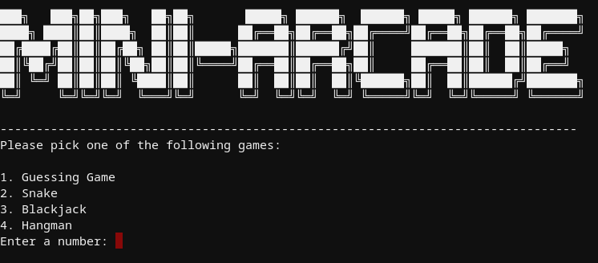
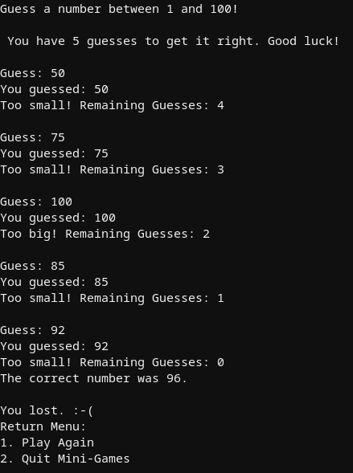
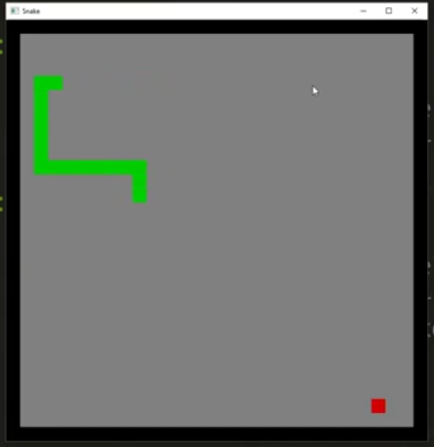
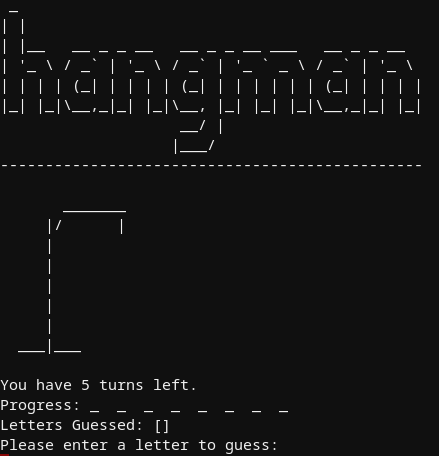
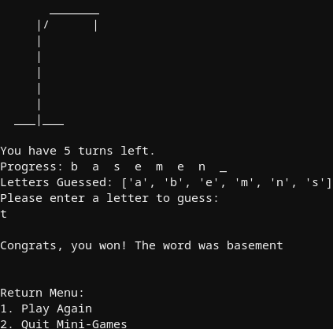
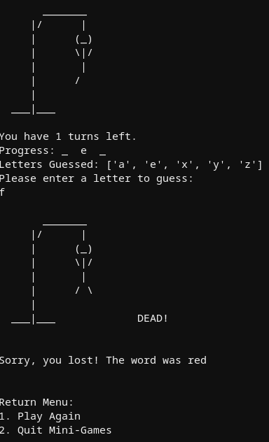
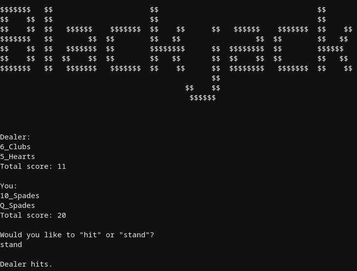
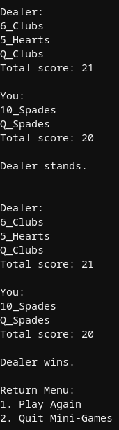

# Tom Lancaster (c) Summer 2019

# Mini-Games

## Project Description
  
A Mini-Game arcade of 4 games. The games are guessing number game, snake, hangman, and blackjack. Clone the repository and "cargo build" or "cargo run" to start the program. 

##Guessing Number Game
Guess the randomly chosen number between 1 and 100 in 5 guesses.

BACKLOG
1. Return to main menu option

##Snake
Classic snake game where snake eats the apple and slowly grows. You use the arrow keys to direct the snake.

BACKLOG
1. Return Menu

##Hangman
GAME PREMISE
User guesses the letters of a word in 5 guesses. If they fail to guess correctly within these guesses, then their man is hung. This version of hangman only has words and not phrases and includes a visual display. You can add words to the "words.txt" file.You cannot guess the entire word in one turn. 
BACKLOG
1. Take in whole phrases and not just words
2. Return to main menu option

##Blackjack
GAME PREMISE
This version of blackjack, also known as 21, uses 1 deck and only has 2 players - you and the dealer. Aces are only scored as 11 instead of switching to 11. Dealer finishes hand after you finish your hand just like in a casino setting.

BACKLOG
1. Multiple Aces logic
2. Return to main menu option

## Example Gameplay Images  
These images were taken from actual gameplay within the command line interface.
## Main Menu

## Guessing Game

## Snake

### Hangman

## Blackjack

##References
1. https://doc.rust-lang.org/stable/book/ch02-00-guessing-game-tutorial.html
2. https://www.youtube.com/watch?v=DnT_7M7L7vo
3. https://github.com/dcode-youtube/hangman-rust
4. https://github.com/chrisccerami/rust-blackjack/src
5. https://github.com/seifriedc/blackjack-rust/tree/master/src 

## License Information

This program is licensed under the "MIT License".  Please
see the file `LICENSE` in the source distribution of this
software for license terms.

